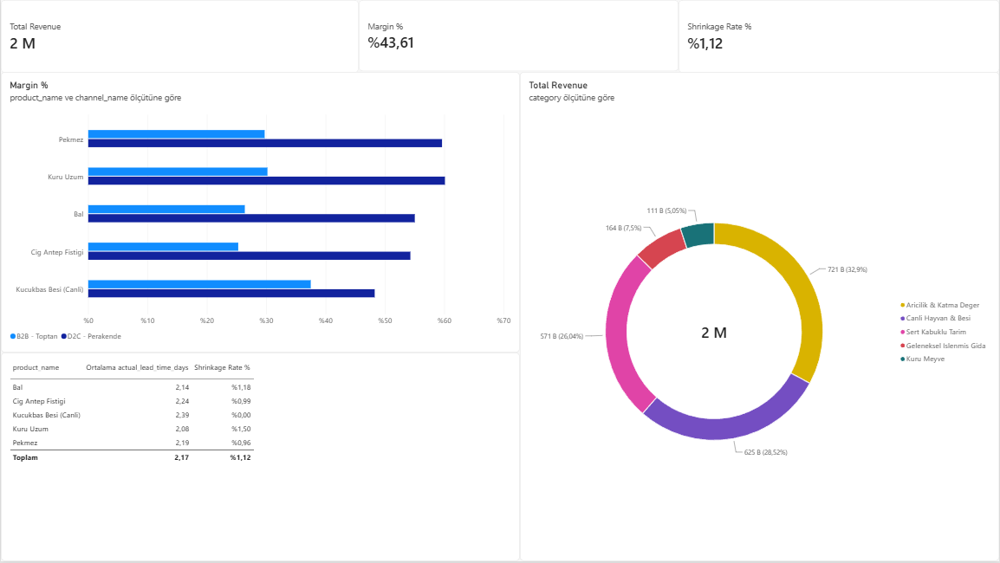

# Agri-Commercial Operations & Multi-Channel Margin Analytics

Uçtan uca bölgesel tarım ve hayvancılık operasyonlarının çok kanallı (B2B Toptan vs. D2C Perakende) satış dinamiklerini, ürün kârlılık arbitrajını, lojistik teslimat sürelerini ve fire oranlarını analiz eden analitik karar destek çözümü.

> **Veri Güvenliği ve Maskeleme Bildirimi (Data Masking & Privacy):**  
> Bu projede kurgulanan ürün portföyü, operasyonel hacim oranları ve kanal dağılımı bölgesel saha dinamiklerini temsil etmektedir. Ticari gizlilik (NDA) ve veri koruma standartları doğrultusunda birim maliyetler, satış fiyatları ve toplam finansal hacimler piyasa rasyonellerine göre maskelenmiş ve anonimleştirilmiştir.

---

## 🏗️ Proje Mimarisi

1. **Veri Modelleme & Üretim (Python / Pandas / NumPy):**
   - 1 yıllık operasyonel dönemi kapsayan, B2B ve D2C dinamiklerini içeren ~215 adetlik transactional veri seti oluşturuldu.
   - Sevkiyat bazlı sipariş-teslimat gün farkları (lead time), ambar/kargo gecikmeleri ve ürün hassasiyetine göre kilo kaybı/fire (shrinkage) metrikleri parametrik olarak modellendi.

2. **İlişkisel Veri Ambarı & Analitik SQL (SQLite):**
   - Ham veriler SQLite ilişkisel veri tabanına işlendi.
   - **Kanal Arbitrajı:** CTE (Common Table Expressions) ile B2B toptan ve D2C doğrudan satış kanalları arasındaki brüt marj farkları hesaplandı.
   - **Lojistik & Fire Risk Derecelendirmesi:** `DENSE_RANK()` pencere fonksiyonları (Window Functions) kullanılarak teslimat gecikmesi ve fire maliyetine göre ürün bazlı risk sıralaması yapıldı.

3. **İş Zekası & Raporlama (Power BI):**
   - **Star-Schema** mimarisi: 1 Fact (`fact_commercial_sales`) ve 2 Dimension (`dim_product`, `dim_channel`) tablosu bire-çok (1-to-many) ilişkilerle modellendi.
   - Dinamik DAX ölçüleri (Measures) geliştirildi: `Total Revenue`, `Margin %`, `Shrinkage Rate %`, `Direct Channel Margin Premium`.

---

## 📊 Yönetici Karar Destek Kokpiti



---

## 💡 Temel İş Çıkarımları & Stratejik Çıkarımlar

* **Kanal Marj Arbitrajı:** Katma değerli ve raf ömrü uzun ürünlerde (Bal, Pekmez, Kuru Üzüm) doğrudan tüketiciye (D2C) satış, B2B toptan satışa kıyasla brüt kâr marjında **+25 ile +30 puanlık** bir kâr artışı sağlamaktadır.
* **Hacim ve Nakit Akışı Dengesi:** Canlı hayvan ve toptan antep fıstığı satışları işletmenin toplam hasılatının ve nakit akışının omurgasını oluştururken, paketli perakende satışlar kâr kütlesini maksimize etmektedir.
* **Lojistik Performans ve Fire:** Perakende kargo siparişlerinde teslimat süresi ortalama 2,1 - 2,4 gün bandında stabilize edilmiş; ambalajlama ve nem kaybı kaynaklı ürün fire oranları ağırlıklı ortalamada **%1,12** seviyesinde kontrol altında tutulmuştur.

---

## 📂 Dizin Yapısı

```text
agri-commercial-analytics/
├── dashboard/             # Power BI (.pbix), DAX formülleri ve pano ekran görüntüsü
├── data/                  # Star-Schema CSV tabloları ve SQLite veri tabanı
├── scripts/               # Veri simülasyonu ve Star-Schema modelleme betikleri
├── sql/                   # Analitik SQL sorguları (CTE, Window Functions)
└── README.md              # Proje dokümantasyonu ve yönetici özeti
